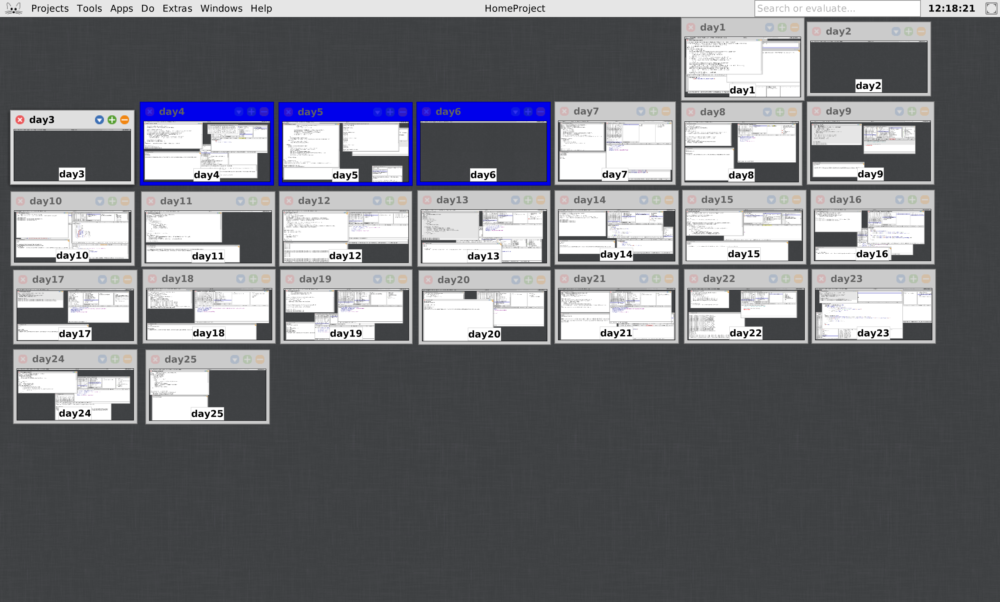

# Advent of code 2023



Let's try Smalltalk this year!  I think I read a book about Smalltalk-80 over
20 years ago, but I remember almost nothing about it, so this should be fun.

I'm starting off with [Squeak](https://squeak.org/), but might move to
[Pharo](https://pharo.org/web/) later if it seems nicer?

I am really not sure how to publish my code.  It seems like my program lives
inside a 60MB VM image of some sort.  Distributing this file feels odd, so I'm
just making a "project" for each day with a workspace where I'm solving
problems, and including a .text transcript that I am then turning into a source
file for now.

## Day 1

The core language is a really nice little functional language with a nice
collections library.  Googling for stuff turns up wiki pages from the early
2000s with serious [Prof. Dr.
Style](http://contemporary-home-computing.org/prof-dr-style/) aesthetics, and
inexplicably a bunch of PDFs from French universities.  It is pretty clear that
nobody uses this language.

## Day 2

Today nothing was printing out in the output window when I did `Transcript
show: 'foo'.`  It turns out that I foolishly opened it by going to Tools >
Transcript instead of middle clicking on the skeuomorphic metallic window
background and selecting "Transcript" from the "World" menu.  And thus, I was
really looking at "Transcript #2".

I have no idea how you print stuff to Transcript #2 vs #1 or what the "World"
menu is for, but that is 10 minutes of my life I'm never getting back.  I am
beginning to form a negative opinion of the Squeak GUI.

It was interesting trying to figure out if there were regular expressions in
Smalltalk.  Yes there are, Virginia!  It seems like the way to find out stuff
about libraries is just to inspect all the running code using a sort of object
browser thing.  You can find classes and methods and stuff by introspection.
But none of the standard library code has any docs, so you can guess at method
names and find them, but you can't really see how to use stuff.

At this point I think I get the language, but I still have no idea how to make
new classes or methods -- there does not seem to be dedicated grammar for this,
I probably have to use the World menu.  Fortunately you can assign blocks
(closures) to variables and then pass them the "value" message, so I kind of
have procedures.  I really need to go find a tutorial or something.

## Day 3

Today I accidentally deleted the project for day 2 somehow.  I closed it to
make a project for day 3, and I must've dismissed a dialog too fast -- welp.
This is clearly a GUI built by unforgiving computer scientists.

My hunch on day 2 was right.  I found a YouTube video recorded 12 years ago by
some guy in Indiana.  As his land line telephone rang in the background, he
explained how you can make new classes using the "Browser" window, and add
methods there too.  Possibly this is all explained in some documentation that I
have just overlooked because I learn about things inside out, but frankly
watching someone use the Squeak GUI is worth 10,000 words.

It is not magic, you're just doing `Object subclass`, but the Browser is where
Squeak wants you to do it.  I thought about making some classes today to get
named tuples, but I decided it was too much clicking for a tiny program.  Maybe
tomorrow.

Somehow, besides the now 71MB VM image, my repository has aquired more stuff.
There is a directory called `Squeaklets` now and a .gif file with a fuzzy
screenshot.  This is all very mysterious.

## Day 4

I deleted day 3 again!  I was even super careful to click "Save", but the
project is just gone now.  It was [a really great
project](https://www.youtube.com/watch?v=c72d4-LpilM).

I remembered enough libraries that I didn't have to hunt around through docs a
lot.  This was a pretty easy counting problem which was a nice relaxing problem
for an early Monday.  I still have not made a new class.

## Day 5

Ok, I think the trick is not to "close" the day N-1 project, but just to go
"back" to the parent project.  I finally managed to keep my day 4 project.

Today's problem was finicky enough that I had to debug my program.  When
something went wrong, a stack trace window popped up and let me see the error a
couple levels down from my user code.  But I couldn't tell how to see the
values of my variables.  And the transcript kept printing out messages about
stuff not being defined, as if it kept going for a few seconds after the error.
I will have to figure this out in coming days.

Most of my mysterious bugs were to do with parentheses.  Smalltalk seems to
have really limited arithmetic precedence, and I found I was better off just
extracting subexpressions when it got too tricky.

I found myself wishing `Interval` had a few more convenience methods for
interval arithmetic, and I think if I were a real Smalltalk person, I would
probably have just added them and made my program nicer.

## Day 6

Today's problem involved finding zeros of a function.  I thought about writing
a binary search, and learned about the `^` operator which lets you return from
within a nested block.  But because the function was just a quadratic I decided
to use the quadratic formula and call it a day.

## Day 7

Today I finally made a class, `Hand`, with some real methods and some simple
tests (and I did `fileOut` so you can see them, too).  For some reason Squeak
wanted me to type my initials when I made these classes, to certify that I was
me.  But my initials were the same as someone else's so it asked if I could
please append some more initials to clarify?  Fortunately I have a middle name.
I really hope nobody else gets my crappy Smalltalk objects in their Squeak
somehow now.

Things seemed to be going well, but then I accidentally added an accessor
method `cards` that did `^ self cards` and hilarity ensued when it tail
recursed infinitely and hung.  So I quit the VM, and it reopend on Day 2 with
none of my work saved, and I got to start over.  At least I learned that
`Cmd + .` is the "interrupt" key.

For some reason half way through the problem, Squeak decided to start
formatting my code for me and renamed all my local variables `t1 t2 t3...`
instead of using the nice names I'd chosen.  This was deeply strange.  I
probably pressed a button?  I liked my names!

At another point, Squeak decided that anything that involved I/O would hang
(but I knew about `Cmd + .` now, so I could recover).  It would print out any
expression, but it would not print things to the transcript, read files or list
them.  Fortunately when I restarted the VM again, it was happy.  Oh, Squeak.

## Day 8

Days since Squeak ate my code: _0_.

Today opensmalltalk-vm spit out a crash dump!  Apparently when things went pear
shaped it was trying to `commenceCogCompiledCodeCompaction` which sounds
alliterative?  The GUI locked up and not even `Cmd + .` would save me, and of
course, it ate my homework again.  An autosave feature would be killer.  I kept
the dump so I could poke around in the VM later out of morbid curiosity.  Sigh,
Squeak.

The problem today was just about finding when some cycles coincided using the
lcm of their periods.  At first I didn't realize the input graph had been
nicely set up for this, so I wrote a Floyd [cycle
detector](https://en.wikipedia.org/wiki/Cycle_detection) and a bunch of messy
arithmetic about which the less said, the better.  I guess it was good practice
with the language, though.

## Day 9

Today was a super easy problem with forward differences of sequences.  It was
so easy, Squeak did not even crash once.  Maybe I was supposed to do this in a
harder way?  Now I am reading about
[Binomial transforms](https://en.wikipedia.org/wiki/Binomial_transform) and the
[Nørlund–Rice integral](https://en.wikipedia.org/wiki/N%C3%B8rlund%E2%80%93Rice_integral).

## Day 10

Today was just fun, with hardly any Squeak drama.

Today we had to orient a loop in a grid and find its area.  My first idea was
to keep track of cells left or right of the loop, and then flood fill those
sets using the heuristic that edge cells are always outside.  But this was both
pretty complicated, and missed some island cells "behind" loop turns.

So I remembered back to polygon rasterization and used the [even-odd
rule](https://en.wikipedia.org/wiki/Even%E2%80%93odd_rule) scanning from left
to right.  At first this didn't work because my parity metric counted all
corners as vertical crossings, but eventually I realized that `┌ ... ┐` runs
did not change sidedness but `┌ ... ┘` did.

## Day 11

I am too tired to make classes today, so I just typed stuff into the workspace.
Squeak don't care.  Squeak's got my back today.  I kind of like programming in
a non-monospace font.  I wish this language had less colons in it.

## Day 12

While it is true that Smalltalk blocks are like closures, the "method return"
`^` operator does not seem to do quite what you would hope inside a recursive
block invocation.

```smalltalk
test := [:x |
	(x = 0) ifTrue: [^1].
	test value: (x-1).
	^42
].
test value: 5.
```

You might reasonably expect this block to recurse 5 times and then return 42,
but in fact it recurses 5 times and returns 1!  In a class method, this
behavior doesn't seem to happen, and `^` really acts like method return.  _Ask
me how I know._

This tricked me so hard that I gave up on counting, and did the first part of
today's problem by enumerating all possibilities and testing matches with a
regular expression!  There were too many possibilities to enumerate in part
two, so I hunkered down and spent an hour trying stupid combinatorial tricks to
avoid debugging.  I finally gave up, figured out what Smalltalk was doing to
me, and moved my block to a memoized recursive class method.

I am a little embarrassed by how long this took today, but I guess I learned
more interesting properties of the `^` operator.  Very tired now.

## Day 13

Today I found the `Matrix` collection, which is nice.  I almost got bitten by
my nemesis the `^` operator again, but I learned my lesson yesterday and made a
class right quick.  I didn't really want to make a class, I just wanted a
function, but you work with what you got.

## Day 14

I had a really cool Smalltalk moment today.  At one point while debugging
something, I printed out a matrix (by highlighting some code and then selecting
"Print it").  This puts some blue text into the workspace.  I happened to hover
over this text and click it, and a window popped up showing the actual object!
The text wasn't just... text.  It was really the object, and acted as a link to
an inspector to go look at it.  Wild.

## Day 15

I wish I had a nice comprehensive reference for Squeak's collections library.
The Browser is just too confusing sometimes, especially since there are no docs
or types and you have to just read the code for each method to see what it
does.

Today I wanted to find the first index matching a predicate in a collection,
so I went poking through `SequenceableCollection`.  It has a whole circus of
cool utilities, like `atWrap:` (wrapping indexing), `combinations:atATimeDo:`
(iterating over combinations), and `changeOfChangesInSlopes:` (honestly not
sure).  Surprisingly though, I couldn't find what I wanted, so I just wrote a
loop using `withIndexDo:` like a cave man.

Belatedly, I went back and found `findFirst:`, which makes a ton of sense and
probably comes up more often than `changeOfChangesInSlopes:`.

## Day 16

I just solved part two by brute force today, but precomputing or caching traces
for each widget in each direction might have been a fun way to do it if the
problem size had been larger.

## Day 17

Another day, another grid.  This would have been a fun year for APL.

I thought we might need A* today, but a best-first search was good enough.  It
seems like the Smalltalk convention is for user types to provide a total order
`<=` rather than a strict weak order `<` for stuff like sorting and heapifying,
which I haven't really seen before.

I hope we get some emulation type problems this year, I think those would be
fun in this language.  Curious to go poke at the VM more.
